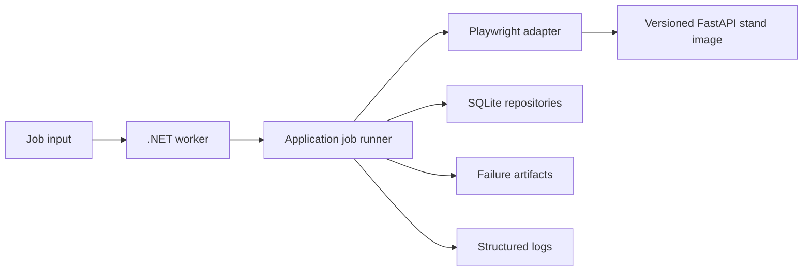

# Resilient Browser Automation

A production-style browser automation worker built with C# and .NET 10.

The project demonstrates idempotent job execution, checkpoint-based recovery,
bounded concurrency, structured logging, failure artifacts, and deterministic
end-to-end tests against a versioned FastAPI test stand.

> Status: runnable worker with SQLite persistence, validated JSON Lines input,
> typed configuration, structured logs, Playwright extraction, retries,
> bounded concurrency, Docker Compose demo, and GitHub Actions proof. Design
> decisions and implementation history are documented in the
> [development plan](docs/development-plan.en.md).

## Why this project

Opening a page and clicking a button proves familiarity with a browser API. This
repository instead focuses on the failure modes that make production browser
automation difficult: interrupted jobs, repeated delivery, transient faults,
DOM drift, duplicates, timeouts, cancellation, and evidence collection.

## Target behavior

The worker will accept a job such as:

```json
{
  "jobId": "catalog-2026-001",
  "target": "demo-catalog",
  "startUrl": "http://demo-site:8080/catalog?scenario=transient&run_id=catalog-2026-001",
  "maxPages": 10
}
```

It launches Chromium through Playwright, traverses the catalog, persists a
checkpoint after each page, resumes after interruption, and stores each item only
once. A terminal failure will produce a screenshot, HTML snapshot, trace, and
machine-readable error metadata.

## Architecture



Dependency direction is inward: domain contracts do not reference Playwright,
SQLite, hosting, or logging implementations.

## Run the deterministic test site

Requirements: Docker with the Compose plugin.

```bash
docker compose pull demo-site
docker compose up --detach --wait demo-site
```

Then open `http://localhost:8080/catalog`. Health status is available at
`http://localhost:8080/health`.

Useful deterministic scenarios:

| URL parameter | Behavior |
| --- | --- |
| `scenario=success` | Normal dynamically rendered pagination |
| `scenario=transient&fail_for=2` | First two API requests per page return 503 |
| `scenario=permanent` | Every catalog API request returns 500 |
| `scenario=slow&delay_ms=3000` | Delayed API response |
| `scenario=resume&fail_page=3` | Pages 1-2 succeed and page 3 fails for checkpoint recovery |
| `scenario=dom-change` | Alternative DOM nesting and CSS classes |
| `scenario=duplicates` | Repeated item IDs across page boundaries |

Use a unique `run_id` query value to isolate counters between test cases. Reset
all counters with `POST /admin/reset`.

Compose pins
`ghcr.io/bockuden/resilient-automation-test-stand:0.4.0`. The stand has an
independent source repository, contract, tests, and release cycle at
[bockuden/resilient-automation-test-stand](https://github.com/bockuden/resilient-automation-test-stand).

## Repository layout

```text
src/
  Automation.Core/          Domain records and invariants
  Automation.Application/   Use-case boundary and ports
docs/                       Architecture decisions and English execution plan
tests/                      C# unit and integration test projects
```

The complete English plan is tracked at
[`docs/development-plan.en.md`](docs/development-plan.en.md).

## Verification available now

```bash
docker compose config
docker compose pull demo-site
docker compose up --detach --wait demo-site
dotnet build --configuration Release
```

The C# build requires the .NET 10 SDK selected by `global.json`.

On this development checkout, SDK `10.0.302` is installed repository-locally in
the ignored `.dotnet` directory. PowerShell users can invoke it without changing
the system PATH:

```powershell
.\eng\dotnet.ps1 --version
.\eng\dotnet.ps1 build .\ResilientBrowserAutomation.sln `
  --configuration Release --no-restore --disable-build-servers '-m:1' `
  '-p:UseSharedCompilation=false'
```

The FastAPI stand's package, CLI, API contract, and release instructions live in
its [independent repository](https://github.com/bockuden/resilient-automation-test-stand).
The extraction is recorded in [ADR 0003](docs/adr/0003-extract-fastapi-test-stand.md).

## CI and release proof

GitHub Actions runs two read-only jobs:

- fast .NET restore, build, analyzer/format check, unit tests, and integration tests;
- browser E2E with only Chromium and required Linux dependencies installed,
  using the pinned external stand image.

The stand repository independently tests Python 3.11–3.13, builds wheel/sdist,
checks the OpenAPI snapshot, and verifies its production image before release.

The workflow caches NuGet packages only. Browser profiles, generated databases,
traces, screenshots, and artifacts are not cached. E2E artifacts are uploaded
only when the browser job fails.

Release-oriented documentation:

| Document | Purpose |
| --- | --- |
| [Architecture](docs/architecture.md) | Project boundaries and execution flow |
| [Failure matrix](docs/failure-matrix.md) | Classification, action, and evidence |
| [Security](docs/security.md) | Secrets, artifacts, CI permissions, containers |
| [Troubleshooting](docs/troubleshooting.md) | Common local and Docker failure modes |
| [Limitations](docs/limitations.md) | Explicit non-goals and review positioning |
| [Release checklist](docs/release-checklist.md) | Checks before tagging `v1.0.0` |

## Run the worker

The current worker uses Playwright and persists jobs, typed catalog items,
attempts, and checkpoints in SQLite. Each item contains its external ID, name,
price, source page number, and source URL. Input accepts one JSON object per
line either from a file or standard input, including a UTF-8 BOM on the first
standard-input record.

```powershell
.\eng\dotnet.ps1 run --project .\src\Automation.Worker\Automation.Worker.csproj `
  -- --jobs .\samples\jobs.success.jsonl
```

The final JSON line is a machine-readable summary. Exit code `0` means every
job completed; `2` means one or more input lines were rejected; `3` means a job
failed; `4` means cancellation. The worker reads settings from
[`appsettings.json`](src/Automation.Worker/appsettings.json); all timeout,
retry, concurrency, storage, and artifact values are validated when it starts.
`Automation:Storage:StaleRunningJobSeconds` defines when an interrupted
`Running` job can be claimed again; completed jobs are never reopened.

## Playwright extraction

Build first, then install the Chromium revision paired with the pinned
Playwright package. The local browser directory is ignored by Git.

```powershell
$env:PLAYWRIGHT_BROWSERS_PATH = "$PWD/.playwright-browsers"
.\src\Automation.Worker\bin\Release\net10.0\playwright.ps1 install chromium
```

Pull and start the pinned test stand with `docker compose pull demo-site` and
`docker compose up --detach --wait demo-site`, then run a sample job from
another PowerShell window. The sample expects the published host port at
`localhost:8080`.

```powershell
$env:PLAYWRIGHT_BROWSERS_PATH = "$PWD/.playwright-browsers"
.\eng\dotnet.ps1 run --project .\src\Automation.Worker\Automation.Worker.csproj `
  --configuration Release -- --jobs .\samples\jobs.success.jsonl
```

The worker owns one Chromium lifecycle and gives every job its own browser
context. Catalog extraction uses `data-testid` and role/label locators, so the
`dom-change` scenario preserves the same result. The `DemoUsername` and
`DemoPassword` settings are only for the deterministic local stand and are
never written to logs. The worker fills the labelled login fields, clicks
`Sign in`, reads item cards, and clicks `Next page` until the button is absent
or `maxPages` is reached.

## Retry and timeout behavior

For HTTP `408`, `429`, `502`, `503`, `504`, selected browser timeouts, and
browser disconnects, the worker retries the current page with bounded
exponential backoff and jitter. `Retry-After` is preferred when it fits the
remaining whole-job budget. A permanent HTTP 500 or an invalid DOM contract is
not retried. Retry logs include the reason, next attempt, delay, and remaining
budget; cancellation interrupts backoff immediately.

## Failure evidence and metrics

For a terminal browser failure, the worker writes a redacted bundle to
`artifacts/{safe-job-id}/{attempt}/`: `error.json`, `page.html`,
`screenshot.png`, and `trace.zip` when each item is available. Metadata is
written atomically; a failure while collecting diagnostics never replaces the
original automation error. Retention is configured through
`Automation:Artifacts:RetentionDays` and `MaximumTotalSizeMegabytes`.

JSON logs use stable event IDs: `1000` input rejection, `1001` completion,
`1002` cancellation, `1003` job failure, `2001` retry scheduled, and `3001`
artifact bundle created. The process exposes .NET `Meter` instruments named
`automation.jobs.*`, `automation.pages.completed`, and `automation.retries`.
They include completed, idempotently skipped, failed, and cancelled job
counters plus a job-duration histogram.

## Concurrency and target rate limiting

Worker intake uses a bounded channel configured by
`Automation:Concurrency:QueueCapacity`. `MaxConcurrentJobs` controls how many
jobs may execute at the same time, and each job keeps its own log scope with
`jobId`, `target`, `executionAttempt`, and `workerId`.

Before a job starts, the worker applies a per-target token bucket using
`PerTargetRateLimit`, `PerTargetRatePeriodMilliseconds`, and
`PerTargetBurstSize`. On shutdown, intake stops immediately; active jobs are
given `ShutdownGracePeriodSeconds` before the remaining work is cancelled.

## Docker Compose demo

The Compose demo combines the worker, versioned FastAPI stand image, SQLite
state, and failure artifacts behind one local command:

```powershell
.\eng\demo-compose.ps1
```

The script resets `artifacts/docker-demo`, pulls and starts `demo-site`, runs success,
idempotent duplicate delivery, transient retry, natural pagination end,
duplicate-item, bounded concurrency, real checkpoint resume, graceful
cancellation, and permanent-failure scenarios. It then prints SQLite counters
and generated evidence files. The worker image uses .NET 10, installs Chromium
with Playwright's Linux dependencies during the image build, and runs as the
non-root `app` user. The Compose `worker` and `demo-report` services are behind
the `demo` profile, so `docker compose up demo-site` remains a lightweight
deterministic-target command.

Terminal failure evidence has this shape:

```text
artifacts/docker-demo/artifacts/compose-permanent/1/
  error.json
  page.html
  screenshot.png
  trace.zip
```

## Engineering principles

- At-least-once job delivery with exactly-once observable results per `jobId`.
- Checkpoints are committed only after extracted items are durably stored.
- Retries cover explicitly transient failures, never arbitrary exceptions.
- Every timeout and retry budget is finite and configurable.
- Cancellation flows through every asynchronous boundary.
- Integration tests use only the local deterministic site.
- Logs contain identifiers and decisions; artifacts contain page evidence.
- Secrets, local databases, browsers, and generated artifacts never enter Git.

## License

[MIT](LICENSE)
