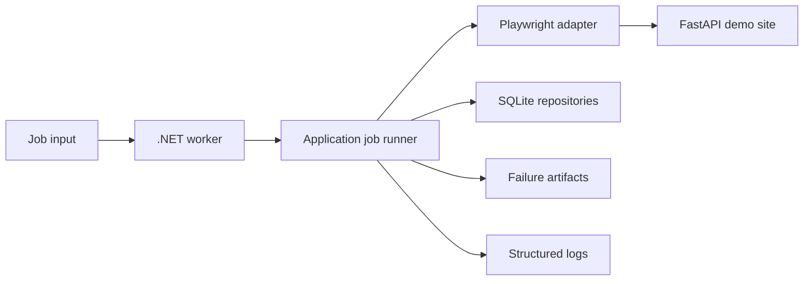

# Resilient Browser Automation

A production-style browser automation worker built with C# and .NET 10.

The project demonstrates idempotent job execution, checkpoint-based recovery,
bounded concurrency, structured logging, failure artifacts, and deterministic
end-to-end tests against a local FastAPI test site.

> Status: runnable worker with SQLite persistence, validated JSON Lines input,
> typed configuration, structured logs, and a deterministic test site. The implementation is
> intentionally split into reviewable milestones in the
> [development plan](docs/development-plan.en.md).

## Why this project

Opening a page and clicking a button proves familiarity with a browser API. This
repository instead focuses on the failure modes that make production browser
automation difficult: interrupted jobs, repeated delivery, transient faults,
DOM drift, duplicates, timeouts, cancellation, and evidence collection.

## Target behavior

The worker will accept a job such as:

```json
{
  "jobId": "catalog-2026-001",
  "target": "demo-catalog",
  "startUrl": "http://demo-site:8080/catalog?scenario=transient&run_id=catalog-2026-001",
  "maxPages": 10
}
```

It launches Chromium through Playwright, traverses the catalog, persists a
checkpoint after each page, resume after interruption, and store each item only
once. A terminal failure will produce a screenshot, HTML snapshot, trace, and
machine-readable error metadata.

## Architecture



Dependency direction is inward: domain contracts do not reference Playwright,
SQLite, hosting, or logging implementations.

## Run the deterministic test site

Requirements: Docker with the Compose plugin.

```bash
docker compose up --build demo-site
```

Then open `http://localhost:8080/catalog`. Health status is available at
`http://localhost:8080/health`.

Useful deterministic scenarios:

| URL parameter | Behavior |
| --- | --- |
| `scenario=success` | Normal dynamically rendered pagination |
| `scenario=transient&fail_for=2` | First two API requests per page return 503 |
| `scenario=permanent` | Every catalog API request returns 500 |
| `scenario=slow&delay_ms=3000` | Delayed API response |
| `scenario=dom-change` | Alternative DOM nesting and CSS classes |
| `scenario=duplicates` | Repeated item IDs across page boundaries |

Use a unique `run_id` query value to isolate counters between test cases. Reset
all counters with `POST /admin/reset`.

## Repository layout

```text
src/
  Automation.Core/          Domain records and invariants
  Automation.Application/   Use-case boundary and ports
test-stand/                 Deterministic FastAPI browser target
docs/                       Architecture decisions and English execution plan
tests/                      C# test projects added by the implementation plan
```

The complete English plan is tracked at
[`docs/development-plan.en.md`](docs/development-plan.en.md). A Russian working
plan exists locally at `docs/development-plan.ru.md` and is excluded through
the repository-local Git exclude file, not through `.gitignore`.

## Verification available now

```bash
docker compose config
docker compose run --rm demo-site pytest -q
dotnet build --configuration Release
```

The C# build requires the .NET 10 SDK selected by `global.json`.

On this development checkout, SDK `10.0.302` is installed repository-locally in
the ignored `.dotnet` directory. PowerShell users can invoke it without changing
the system PATH:

```powershell
.\eng\dotnet.ps1 --version
.\eng\dotnet.ps1 build .\ResilientBrowserAutomation.sln `
  --configuration Release --no-restore --disable-build-servers '-m:1' `
  '-p:UseSharedCompilation=false'
```

The FastAPI stand also has its own installable package boundary and CLI. See the
[`test-stand` README](test-stand/README.md) and
[ADR 0002](docs/adr/0002-package-ready-test-stand.md).

## Run the worker intake (Milestone 1)

The current worker persists jobs, items, attempts, and checkpoints in SQLite;
it still uses a fake browser adapter until the Playwright milestone. It accepts
one JSON object per line either from a file or standard input.

```powershell
.\eng\dotnet.ps1 run --project .\src\Automation.Worker\Automation.Worker.csproj `
  -- --jobs .\samples\jobs.success.jsonl
```

The final JSON line is a machine-readable summary. Exit code `0` means every
job completed; `2` means one or more input lines were rejected; `3` means a job
failed; `4` means cancellation. The worker reads settings from
[`appsettings.json`](src/Automation.Worker/appsettings.json); all timeout,
retry, concurrency, storage, and artifact values are validated when it starts.
`Automation:Storage:StaleRunningJobSeconds` defines when an interrupted
`Running` job can be claimed again; completed jobs are never reopened.

## Run Playwright extraction (Milestone 3)

Build first, then install the Chromium revision paired with the pinned
Playwright package. The local browser directory is ignored by Git.

```powershell
$env:PLAYWRIGHT_BROWSERS_PATH = "$PWD/.playwright-browsers"
.\src\Automation.Worker\bin\Release\net10.0\playwright.ps1 install chromium
```

Start the test stand with `docker compose up --build demo-site`, then run a
sample job from another PowerShell window. The sample expects the published
host port at `localhost:8080`.

```powershell
$env:PLAYWRIGHT_BROWSERS_PATH = "$PWD/.playwright-browsers"
.\eng\dotnet.ps1 run --project .\src\Automation.Worker\Automation.Worker.csproj `
  --configuration Release -- --jobs .\samples\jobs.success.jsonl
```

The worker owns one Chromium lifecycle and gives every job its own browser
context. Catalog extraction uses `data-testid` and role/label locators, so the
`dom-change` scenario preserves the same result. The `DemoUsername` and
`DemoPassword` settings are only for the deterministic local stand and are
never written to logs.

## Retry and timeout behavior (Milestone 4)

For HTTP `408`, `429`, `502`, `503`, `504`, selected browser timeouts, and
browser disconnects, the worker retries the current page with bounded
exponential backoff and jitter. `Retry-After` is preferred when it fits the
remaining whole-job budget. A permanent HTTP 500 or an invalid DOM contract is
not retried. Retry logs include the reason, next attempt, delay, and remaining
budget; cancellation interrupts backoff immediately.

## Failure evidence and metrics (Milestone 5)

For a terminal browser failure, the worker writes a redacted bundle to
`artifacts/{safe-job-id}/{attempt}/`: `error.json`, `page.html`,
`screenshot.png`, and `trace.zip` when each item is available. Metadata is
written atomically; a failure while collecting diagnostics never replaces the
original automation error. Retention is configured through
`Automation:Artifacts:RetentionDays` and `MaximumTotalSizeMegabytes`.

JSON logs use stable event IDs: `1000` input rejection, `1001` completion,
`1002` cancellation, `1003` job failure, `2001` retry scheduled, and `3001`
artifact bundle created. The process exposes .NET `Meter` instruments named
`automation.jobs.*`, `automation.pages.completed`, and `automation.retries`.

## Concurrency and target rate limiting (Milestone 6)

Worker intake uses a bounded channel configured by
`Automation:Concurrency:QueueCapacity`. `MaxConcurrentJobs` controls how many
jobs may execute at the same time, and each job keeps its own log scope with
`jobId`, `target`, `executionAttempt`, and `workerId`.

Before a job starts, the worker applies a per-target token bucket using
`PerTargetRateLimit`, `PerTargetRatePeriodMilliseconds`, and
`PerTargetBurstSize`. On shutdown, intake stops immediately; active jobs are
given `ShutdownGracePeriodSeconds` before the remaining work is cancelled.

## Engineering principles

- At-least-once job delivery with exactly-once observable results per `jobId`.
- Checkpoints are committed only after extracted items are durably stored.
- Retries cover explicitly transient failures, never arbitrary exceptions.
- Every timeout and retry budget is finite and configurable.
- Cancellation flows through every asynchronous boundary.
- Integration tests use only the local deterministic site.
- Logs contain identifiers and decisions; artifacts contain page evidence.
- Secrets, local databases, browsers, and generated artifacts never enter Git.

## License

[MIT](LICENSE)
