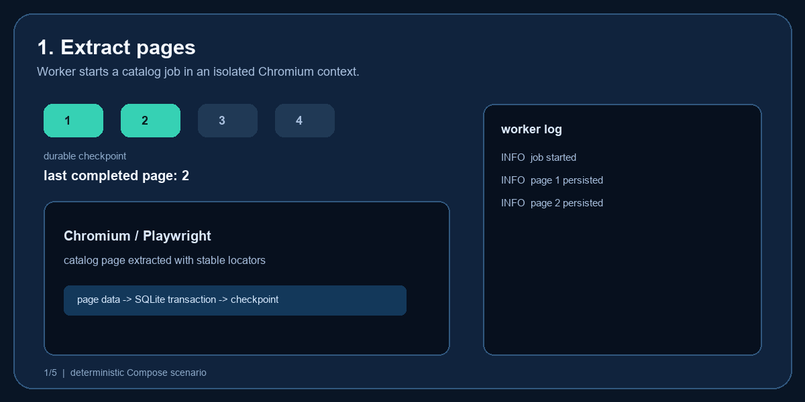
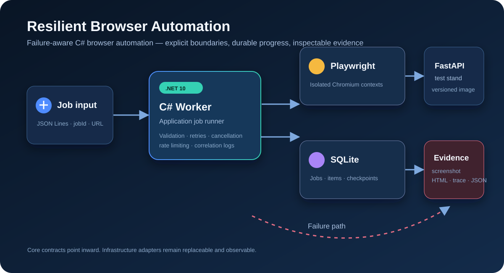
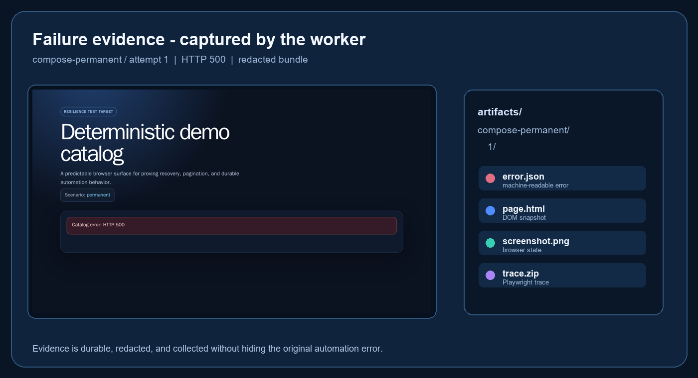
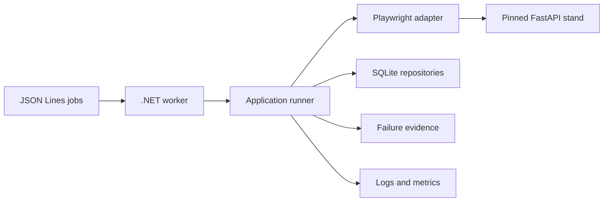

# Resilient Browser Automation

[](https://github.com/bockuden/resilient-browser-automation/actions/workflows/tests.yml)
[](https://github.com/bockuden/resilient-browser-automation/releases)

[](LICENSE)

A production-style C#/.NET 10 browser automation worker built around recovery,
idempotency, finite retry budgets, and inspectable failure evidence.

It combines Playwright, durable SQLite checkpoints, bounded concurrency,
structured telemetry, and deterministic browser E2E against an independently
released FastAPI Test Stand.

## Run the Complete Demo

Requirements: Docker Desktop or another Docker Engine with Compose, plus
PowerShell. The worker and stand run in containers; host .NET and Python are not
required.

```powershell
git clone https://github.com/bockuden/resilient-browser-automation.git
cd resilient-browser-automation
git checkout v1.0.0
.\eng\demo-compose.ps1
```

This single scenario starts the exact pinned Test Stand, builds the worker, and
proves success, idempotent re-delivery, transient recovery, natural pagination
end, duplicate handling, concurrency, checkpoint resume, cancellation, and
terminal failure evidence. The generated SQLite state and evidence are under
`artifacts/docker-demo/`.

See [running and operating the worker](docs/usage.md) for host execution,
individual scenarios, configuration, exit codes, and observability.

## Visible Proof

<p align="center">
  
</p>

The Compose demo produces the illustrated recovery flow: pages 1–2 remain
durable, a page-3 failure is observed, and the next execution resumes without
replaying stored pages.

<p align="center">
  
</p>

<p align="center">
  
</p>

A permanent browser failure writes redacted `error.json`, `page.html`,
`screenshot.png`, and `trace.zip` evidence.

## What the Worker Proves

- At-least-once job delivery with exactly-once observable results per `jobId`.
- Items are durable before the page checkpoint advances.
- Interrupted work resumes from the last committed page.
- Only classified transient failures retry, within finite timeout budgets.
- Cancellation crosses every asynchronous boundary.
- Bounded intake, job concurrency, and per-target token-bucket rate limiting.
- Structured JSON logs, stable event IDs, and .NET `Meter` instruments.
- Terminal browser failures leave inspectable, retention-controlled evidence.

The Playwright adapter signs in when required, extracts each item's external
ID, name, price, source page, and source URL, then follows `Next page` until the
catalog ends or `maxPages` is reached. Stable semantic locators survive the
stand's DOM-change scenario.

## Architecture



Core and application contracts point inward; browser, persistence, hosting,
and telemetry remain infrastructure concerns. See
[architecture.md](docs/architecture.md) for project boundaries and the
execution sequence.

## Release and Compatibility Proof

[`v1.0.0`](https://github.com/bockuden/resilient-browser-automation/releases/tag/v1.0.0)
is validated against the exact released image
`ghcr.io/bockuden/resilient-automation-test-stand:1.1.3`, never `latest`.
The tagged release passed build, analyzers, unit tests, integration tests, and
the complete Chromium recovery flow in
[GitHub Actions](https://github.com/bockuden/resilient-browser-automation/actions/runs/30397596555).

The full local Compose proof completed with 9 successful jobs, 1 expected
cancelled job, 1 expected failed job with evidence, and 117 persisted catalog
items. Exact image digests and tested scenario levels are recorded in the
[compatibility matrix](docs/compatibility-matrix.md).

The Test Stand has its own Python package, OpenAPI contract, CI, image, and
release cycle in
[bockuden/resilient-automation-test-stand](https://github.com/bockuden/resilient-automation-test-stand).
The stable Compose pin changes only after an explicit compatibility review. A
scheduled canary may test a newer published stand release, but never updates
the pin automatically.

## CI

The regular workflow runs:

- .NET restore, Release build, formatting/analyzer checks, unit tests, and
  integration tests;
- Chromium browser E2E against the stable pinned Test Stand.

Tag-based releases additionally require the full Compose E2E before building
and publishing the worker image, generating an SBOM, and creating the GitHub
Release.

## Repository Layout

```text
src/
  Automation.Core/          Domain records and invariants
  Automation.Application/   Use cases and ports
  Automation.Playwright/    Chromium interaction and evidence capture
  Automation.Storage/       SQLite persistence
  Automation.Worker/        Host, configuration, intake and concurrency
tests/                      Unit and integration tests
eng/                        Reproducible PowerShell entry points
docs/                       Architecture, operations and release evidence
```

## Documentation

| Document | Purpose |
| --- | --- |
| [Usage](docs/usage.md) | Compose demo, host execution, configuration and behavior |
| [Architecture](docs/architecture.md) | Boundaries, execution flow and concurrency |
| [Failure matrix](docs/failure-matrix.md) | Failure classification, action and evidence |
| [Security](SECURITY.md) | Reporting vulnerabilities and security policy |
| [Security design](docs/security.md) | Secrets, artifacts, CI and containers |
| [Troubleshooting](docs/troubleshooting.md) | Common local and Docker failures |
| [Limitations](docs/limitations.md) | Explicit non-goals and honest positioning |
| [Compatibility matrix](docs/compatibility-matrix.md) | Exact consumer/stand validation pairs |
| [Release notes](docs/releases/v1.0.0.md) | Stable release behavior and evidence |
| [Changelog](CHANGELOG.md) | Versioned user-visible changes |
| [Contributing](CONTRIBUTING.md) | Development and pull-request workflow |

## Engineering Principles

- Checkpoints advance only after extracted items are durably stored.
- Retries cover explicit transient failures, never arbitrary exceptions.
- Every timeout and retry budget is finite and configurable.
- Generated secrets, databases, browsers, traces, and screenshots stay out of
  Git.
- Integration and browser tests use deterministic local infrastructure.
- Compatibility is proven against exact released dependencies.

## License

[MIT](LICENSE)
