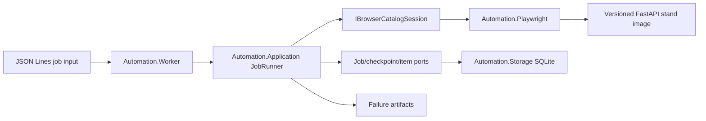

# Architecture

This repository is a compact browser-automation worker, not a scraping
framework. The design keeps unstable infrastructure at the edges and protects
the core execution rules with tests.

## Project Boundaries

| Project | Responsibility | Must not own |
| --- | --- | --- |
| `Automation.Core` | Job, result, checkpoint, and item invariants | Playwright, SQLite, hosting |
| `Automation.Application` | Job execution, idempotency flow, retry policy, ports | Concrete browser or database setup |
| `Automation.Playwright` | Chromium lifecycle, page interaction, extraction, screenshots, HTML, trace | Persistence decisions |
| `Automation.Storage` | SQLite migrations, claims, checkpoints, item upserts | Browser behavior |
| `Automation.Worker` | Host, dependency injection, config, job intake, concurrency | Domain rules |

The deterministic target is an external dependency pinned in Compose as
`ghcr.io/bockuden/resilient-automation-test-stand:1.0.0rc1`. Its source, API
contract, package tests, and release workflow live in the
[stand repository](https://github.com/bockuden/resilient-automation-test-stand).
The worker repository owns compatibility E2E; the stand repository owns its
package and image correctness.

## Execution Flow

1. The worker reads one JSON object per line.
2. Invalid records are rejected before a browser is opened.
3. A valid job is claimed in SQLite by `jobId`.
4. A completed job returns idempotently without opening Chromium.
5. The runner starts from the last durable checkpoint.
6. Playwright extracts ID, name, price, page number, and source URL with stable locators.
7. Items are upserted before the checkpoint is advanced; missing Next ends the job.
8. Classified transient failures retry the current page within the job budget.
9. Terminal browser failures write redacted evidence.
10. Final state is persisted as `Completed`, `Failed`, or `Cancelled`.

## Concurrency Model

Worker intake is a bounded channel. `MaxConcurrentJobs` controls active jobs,
and each active job owns its own browser context. A per-target token bucket
paces starts by `target`, so unrelated targets can proceed while same-target
work is throttled.

On shutdown, intake stops first. Active jobs get the configured grace period and
then receive cancellation. Checkpoints remain useful because they are committed
only after item persistence.
